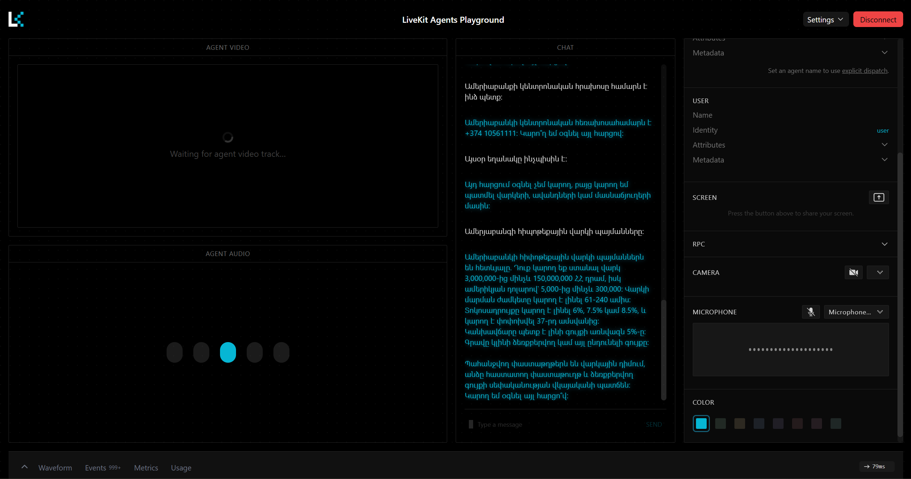
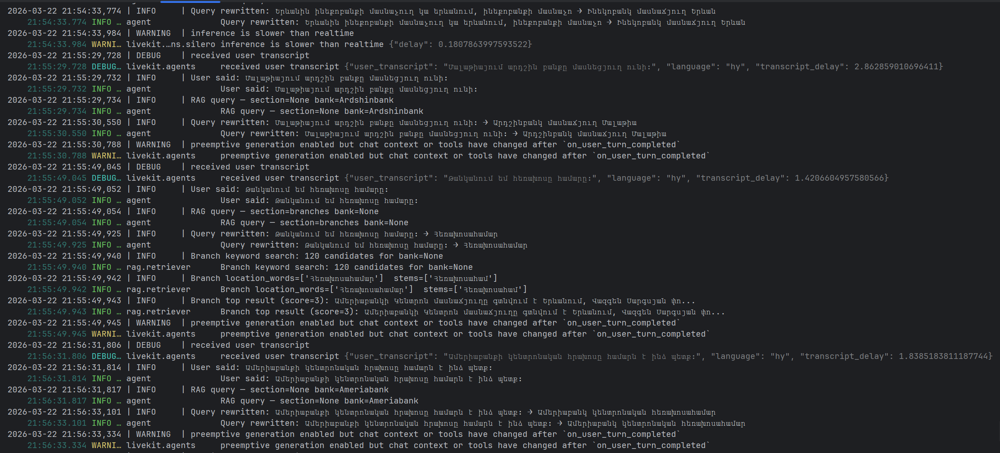

# Armenian Voice AI Support Agent 


---

A voice-powered AI customer support agent for Armenian banks, built with the open-source LiveKit Agents framework. The agent understands and speaks Armenian, answers questions exclusively about credits, deposits, and branch locations, and grounds every response in data scraped directly from official bank websites.

### Supported Banks


### Knowledge Scope


---

## Demo

### Live Conversation in LiveKit Agents Playground
The agent running in the browser-based LiveKit Playground, responding in Armenian to a question about Ameriabank mortgage loans:



### Agent Logs — RAG Pipeline in Action
Terminal output showing real-time query rewriting, keyword search, and RAG retrieval during a live session:



---

## Architecture Overview

```
User Voice
    │
    ▼
LiveKit Server (self-hosted)
    │
    ▼
Agent (LiveKit Agents v1.5.0)
    ├── STT  →  OpenAI Whisper-1  (language: hy)
    ├── VAD  →  Silero VAD
    ├── LLM  →  GPT-4o  +  RAG (ChromaDB)
    └── TTS  →  OpenAI TTS-1  (voice: nova)
```

### Data Pipeline

```
Bank Websites
    │
    ▼
scrapers/  (Playwright + BeautifulSoup + rate.am)
    │  ameriabank.py
    │  ardshinbank.py
    │  inecobank.py
    ▼
pipeline.py  →  bank_data_final.json  (raw scraped data)
    │
    ▼
reformat_data.py  →  bank_data_clean.json  (GPT-4o reformatted, natural Armenian)
    │
    ▼
rag/indexer.py  →  chroma_db/  (ChromaDB vector store)
    │
    ▼
rag/retriever.py  ←  agent.py queries at runtime
```

---

## Design & Model Decisions

### LiveKit (Open Source)
The agent uses the **self-hosted** LiveKit server (`livekit-server`), not LiveKit Cloud. This satisfies the requirement for open-source infrastructure and keeps all audio routing local.

### STT — OpenAI Whisper-1
Whisper-1 was chosen for speech-to-text because it has strong multilingual support, including Armenian (`hy`). A custom prompt biases transcription toward Armenian banking vocabulary (e.g. վարկ, ավանդ, մասնաճյուղ, Ամերիաբանկ), which significantly reduces transcription errors for domain-specific terms.

Deepgram nova-2 was evaluated but does not support Armenian (`hy`) for streaming, making it unsuitable for a real-time voice agent.

### VAD — Silero VAD
Silero VAD runs locally with no external API calls and provides reliable end-of-speech detection. It is the recommended default for LiveKit Agents when not using LiveKit Cloud's adaptive interruption detection.

### LLM — GPT-4o and GPT-4o-mini
Two OpenAI models are used for different purposes:

- **GPT-4o** — main conversation model. Handles the full system prompt in Armenian, respects guardrails, and generates natural responses grounded in RAG context. GPT-4o was chosen over GPT-4o-mini for the main agent because it follows complex Armenian-language instructions more reliably.
- **GPT-4o-mini** — query rewriting. Before each RAG lookup, the user's transcribed question is normalized (case suffixes stripped, city names standardized) using a lightweight GPT-4o-mini call. This adds ~50ms latency but significantly improves retrieval accuracy for location-specific queries.
- **GPT-4o** (offline) — data reformatting. Used once by `reformat_data.py` to convert raw scraped text into clean, natural Armenian sentences suitable for a voice agent.

### TTS — OpenAI TTS-1 (voice: nova)
OpenAI TTS-1 with the `nova` voice produces natural-sounding Armenian speech. ElevenLabs (`eleven_multilingual_v2`) is supported as a configurable alternative via `.env` for higher expressiveness if needed.

### RAG — ChromaDB
Bank data is chunked and indexed into a local ChromaDB vector store. At runtime, the agent retrieves the most relevant chunks for each user query and injects them as context into the LLM prompt. This ensures the agent answers only from official bank data and never fabricates information.

For branch queries, semantic search is bypassed entirely in favour of keyword scoring, because branch records share nearly identical structure and embeddings cannot distinguish between cities reliably.

### Scraping Strategy
Each bank required a different scraping approach:

**Branch data (all three banks)** is sourced primarily from [rate.am](https://www.rate.am), which aggregates Armenian bank branch details (address, phone, working hours) in a consistently structured, scraping-friendly format. This avoids dealing with JavaScript-rendered maps and dynamic content on each bank's own website.

**Credits and deposits** are scraped directly from each bank's official website:

- **Ameriabank** — JavaScript-rendered SPA (React). Playwright headless browser waits for Armenian content to load before extraction.
- **Ardshinbank** — Mixed static and JS-rendered pages. Playwright is used where needed; BeautifulSoup handles static sections.
- **Inecobank** — Largely static HTML. BeautifulSoup with `lxml` is sufficient for most pages.

All scrapers apply post-processing: deduplication, minimum length filtering, truncation at sentence boundaries, and Armenian text validation.

---

## Guardrails

The agent enforces three layers of topic restriction:

1. **Keyword detection** — `detect_section()` checks the transcribed user message for Armenian banking keywords before passing it to the LLM.
2. **Fuzzy matching** — A set of root-word patterns catches common Whisper transcription variants of Armenian words.
3. **System prompt** — The LLM is instructed in Armenian to answer only questions about credits, deposits, and branch locations for Ameriabank, Ardshinbank, and Inecobank, and to refuse all other topics politely.

---

## Project Structure

```
armenian-voice-ai-support-agent/
├── agent.py                  # Main LiveKit agent
├── pipeline.py               # Scraping orchestrator
├── fix_bank_data.py          # Text cleaning utilities
├── merge_branches.py         # Branch data post-processing
├── bank_data_final.json      # Raw scraped bank data
├── bank_data_clean.json      # GPT-4o reformatted data (used by ChromaDB)
├── reformat_data.py          # Reformats raw data into clean Armenian using GPT-4o
├── livekit.yaml              # LiveKit server configuration
├── requirements.txt
├── .env                      # API keys and configuration
├── chroma_db/                # ChromaDB vector store (generated)
├── scrapers/
│   ├── __init__.py
│   ├── base.py               # Base scraper class
│   ├── playwright_base.py    # Playwright-based scraper base
│   ├── ameriabank.py
│   ├── ardshinbank.py
│   └── inecobank.py
└── rag/
    ├── __init__.py
    ├── indexer.py            # Embeds and indexes bank data into ChromaDB
    └── retriever.py          # Queries ChromaDB at runtime
```

---

## Setup Instructions

### Prerequisites

- Python 3.11 or 3.12 (Python 3.13 is supported but may show minor warnings)
- Git

### 1. Clone the Repository

```bash
git clone https://github.com/sonamansuryan/armenian-voice-ai-support-agent
cd armenian-voice-ai-support-agent
```

### 2. Create and Activate a Virtual Environment

```bash
python -m venv .venv

# Windows
.venv\Scripts\activate

# macOS / Linux
source .venv/bin/activate
```

### 3. Install Dependencies

```bash
pip install -r requirements.txt
playwright install chromium
```

### 4. Configure Environment Variables

Copy the example and fill in your API keys:

```bash
cp .env.example .env
```

Edit `.env`:

```env
OPENAI_API_KEY=your_openai_api_key

LIVEKIT_URL=ws://localhost:7880
LIVEKIT_API_KEY=devkey
LIVEKIT_API_SECRET=devsecret-armenian-bank-agent

CHROMA_DB_PATH=chroma_db
BANK_DATA_PATH=bank_data_clean.json

# STT provider: openai (default) or deepgram
STT_PROVIDER=openai

# TTS provider: openai (default) or elevenlabs
TTS_PROVIDER=openai

# Optional — only if TTS_PROVIDER=elevenlabs
# ELEVENLABS_API_KEY=your_elevenlabs_key
# ELEVENLABS_VOICE_ID=your_voice_id

# Optional — only if STT_PROVIDER=deepgram
# DEEPGRAM_API_KEY=your_deepgram_key
```

### 5. Download the LiveKit Server

Download the appropriate binary for your platform from the [LiveKit releases page](https://github.com/livekit/livekit/releases).

For Windows (already included in the repo as `livekit_1.9.12_windows_amd64/`), no additional step is needed.

### 6. Build the Knowledge Base

This step scrapes the bank websites, reformats the data, and indexes it. It only needs to be run once (or when you want to refresh the data).

```bash
# Step 1 — Scrape all three banks
python pipeline.py --output bank_data_final.json

# Step 2 — Reformat raw data into clean natural Armenian using GPT-4o
python reformat_data.py --input bank_data_final.json --output bank_data_clean.json

# Step 3 — Index into ChromaDB
python -m rag.indexer --data bank_data_clean.json --db chroma_db
```

> `chroma_db/` and `bank_data_clean.json` are already included in the repository with pre-built data, so you can skip this step and go directly to running the agent.

---

## Running the Agent

You need three terminal windows.

### Terminal 1 — Start the LiveKit Server

```bash
# Windows
.\livekit_1.9.12_windows_amd64\livekit-server.exe --config livekit.yaml

# macOS / Linux
./livekit-server --config livekit.yaml
```

You should see:
```
INFO  starting LiveKit server  {"portHttp": 7880}
```

### Terminal 2 — Start the Agent

```bash
python agent.py dev
```

You should see:
```
INFO  registered worker  {"url": "ws://localhost:7880"}
```

### Terminal 3 — Generate an Access Token

```bash
python -c "
from livekit.api import AccessToken, VideoGrants
import warnings
warnings.filterwarnings('ignore')
t = (AccessToken('devkey', 'devsecret-armenian-bank-agent')
     .with_grants(VideoGrants(room_join=True, room='test-room'))
     .with_identity('user')
     .to_jwt())
with open('token.txt', 'w') as f:
    f.write(t)
print('Token saved to token.txt')
"
```

---

## Connecting via the LiveKit Playground

1. Open [https://agents-playground.livekit.io](https://agents-playground.livekit.io)
2. Click **Settings** (top right)
3. Set:
   - **LiveKit URL**: `ws://localhost:7880`
   - **Token**: paste the contents of `token.txt`
4. Click **Connect**
5. Go to the **Audio** tab and enable your microphone
6. The agent will greet you in Armenian — you can now speak

> Note: the playground must be able to reach `localhost:7880` from your browser. If you are running the server on a remote machine, use its public IP or set up an SSH tunnel.

---

## Example Questions to Test

| Topic | Example (Armenian) |
|---|---|
| Branches | «Ինեկոբանկի մասնաճյուղ կա՞ Երևանում» |
| Branch hours | «Աշխատանքային ժամերը կասե՞ք» |
| Credits | «Ամերիաբանկի սպառողական վարկի տոկոսադրույքը որքա՞ն է» |
| Mortgage | «Հիփոթեքային վարկ եմ ուզում վերցնել» |
| Deposits | «Դոլարով ավանդ կարո՞ղ եմ դնել Արդշինբանկում» |
| Off-topic (guardrail) | «Եղանակը ինչպիսի՞ն է այսօր» |

---

## Adding a New Bank

The system is designed to scale to additional banks with minimal effort:

1. Create `scrapers/newbank.py` extending `BaseBankScraper` (or `PlaywrightBankScraper` for JS-rendered sites)
2. Register it in `scrapers/__init__.py`:
   ```python
   from .newbank import NewBankScraper
   SCRAPER_REGISTRY["newbank"] = NewBankScraper
   ```
3. Add the bank's Armenian name keywords to `BANK_KEYWORDS` in `agent.py`
4. Re-run the pipeline and re-index:
   ```bash
   python pipeline.py --output bank_data_final.json
   python reformat_data.py --input bank_data_final.json --output bank_data_clean.json
   python -m rag.indexer --data bank_data_clean.json --db chroma_db
   ```

No other changes to `agent.py` or the RAG layer are required.

---

## API Keys Required

| Service | Purpose | Required |
|---|---|---|
| OpenAI | STT (Whisper-1), LLM (GPT-4o), TTS (TTS-1), Data reformatting (GPT-4o) | Yes |
| Deepgram | Alternative STT | No |
| ElevenLabs | Alternative TTS | No |

---

## Contact

**Author:** Sona Mansuryan

**Gmail:** mansuryansona04@gmail.com